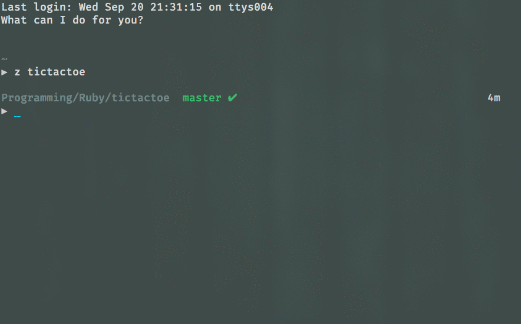

# Tic Tac Toe


An implementation of Tic Tac Toe for the challenge posted on [Dev.to](https://dev.to/briandgls/tic-tac-toe-a-devto-community-challenge).  Supposed to be 30-60 minutes.  We'll see how that goes.



## Test It Out

Clone the repository.

```bash
$ git clone https://github.com/rpalo/tictactoe-rb
```

Start a game via the command line.

```bash
$ cd tictactoe-rb
$ ./bin/play defensive  # (or basic, random, or human to play 2 players!)
```

Enjoy!

## Feeback

I'm just starting to really dig into Ruby, so if you've got any feedback on the way that I've done things, how my code looks, how the project is laid out, the way my tests look, or anything else, I'd love to hear it.  Open an issue and let me know about it.  Thanks so much!

## Goals

- [x] Get a working tic tac toe game, where the user can put x's into whatever square they want.
- [x] Make them alternate with the computer, with the computer putting in the first possible spot.
- [ ] *Stretch goal*: Make the AI brute force the options.
- [ ] *Super Stretch Goal*: Make the AI use an actual graph-based search pattern.
- [ ] *Stretch goal*: Make a GUI for it.
